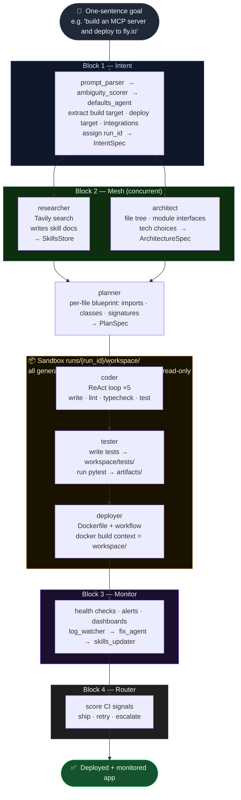

# meta-builder

A fully autonomous software delivery system. Write a one-sentence goal. The system researches, architects, codes, tests, deploys, monitors, and self-heals — permanently, without asking for help.

**17 agents. 4 blocks. One human input.**

---

## System overview



---

## How it works

```
Human writes a goal
        ↓
  Block 1 — Intent resolver      parse → score → fill defaults → IntentSpec
        ↓
  Block 2 — Parallel mesh        researcher + architect run concurrently
        ↓
  Block 2 — Planner              per-file blueprint (imports · classes · signatures)
        ↓
  Block 2 — Sandbox loop         coder ×5 → tester ×3 → deployer ×2
            (runs/{run_id}/workspace/ — all writes isolated from main repo)
        ↓
  Block 3 — Monitor              watch logs → classify → patch → validate → update skills
        ↓
  Block 4 — Router               score CI signals → auto-merge or async ping
```

---

## Project structure

```
agent/
  orchestrator.py         entry point — reads intent spec, fires mesh
  intent/                 prompt_parser · ambiguity_scorer · defaults_agent
  mesh/                   researcher · architect · planner · plan_validator
                          coder · tester · deployer · monitor_setup
  router/                 signal_collector · scorer · router
  monitor/                log_watcher · anomaly_classifier · context_builder
                          fix_agent · validator · skills_updater
  shared/                 run_context · sandbox · skills_store
                          capabilities · state · intent_spec · decision_log

skills/                   compounding knowledge base — read globally, write via SkillsStore API
runs/                     per-run sandboxes: runs/{run_id}/workspace/ · artifacts/ · logs/
mcp/                      MCP servers: github · web_search · filesystem
.agent/                   task-graph.json · intent-spec.json (runtime state)
.github/workflows/        agent-build.yml · agent-fix.yml
docker/                   Dockerfile.agent
tests/                    unit + integration tests per agent and block
```

---

## Stack

| Layer | Technology |
|---|---|
| Agent framework | [Deep Agents](https://docs.langchain.com/oss/python/deepagents/overview) (LangGraph runtime) |
| LLM calls | Anthropic SDK — `claude-sonnet-4-6` |
| Tool protocol | MCP (stdio transport) |
| Shared state | Redis task graph + disk `skills/` |
| Ephemeral agents | GitHub Actions |
| Persistent workers | Fly.io (monitor + fix loop, always-on) |
| Tracing | LangSmith |

---

## Setup

```bash
git clone git@github.com:routifai/meta-builder.git
cd meta-builder
python -m venv .venv && source .venv/bin/activate
pip install -e ".[dev]"
cp .env.example .env   # fill in your keys
```

**Required env vars** (see `.env.example`):
- `ANTHROPIC_API_KEY`
- `REDIS_URL`
- `GITHUB_TOKEN` + `GITHUB_REPO`
- `LANGSMITH_API_KEY` (optional but recommended)

---

## Running tests

```bash
# Full suite
pytest tests/ -v

# Shared layer only
pytest tests/unit/shared/ -v

# Single agent
pytest tests/unit/intent/test_prompt_parser.py -v
```

---

## Build progress

| Block | Component | Status |
|---|---|---|
| Intent resolver | prompt_parser, ambiguity_scorer, defaults_agent | ✅ built |
| Shared layer | run_context, sandbox, skills_store, capabilities, decision_log | ✅ built |
| Parallel mesh | researcher, architect | ✅ built |
| Planner | planner, plan_validator | ✅ built |
| Coder | coder (ReAct loop + sandbox enforcement) | ✅ built |
| Tester | tester (write + run, workspace/tests/) | ✅ built |
| Deployer | deployer (workspace build context) | 🔲 stub |
| Monitor setup | monitor_setup | 🔲 stub |
| Router | signal_collector, scorer, router | 🔲 stub |
| Monitor / fix loop | log_watcher, anomaly_classifier, context_builder, fix_agent, validator, skills_updater | 🔲 stub |

---

## Design principles

- **Skills-first** — before writing code, agents research and write `skills/` docs. Knowledge compounds across runs.
- **Intent spec replaces gates** — one structured spec at the start; agents fill gaps with defaults. Human only surfaces for genuine blockers.
- **Parallel mesh** — researcher and architect run concurrently; tester writes tests while coder writes code.
- **Human as stakeholder** — not in the critical path. Auto-merges when CI is green. Async ping when confidence is low.
- **Self-healing** — monitor watches production forever. Patches are written, validated, and merged automatically when confidence > 85.
- **Decision log** — every irreversible action (deploy, merge, PR) is written to `decision-log/` before it happens. Full audit trail.
